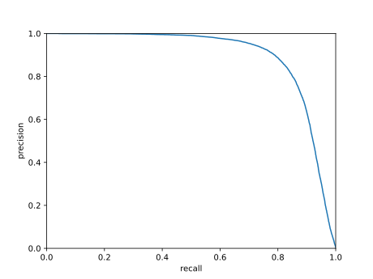
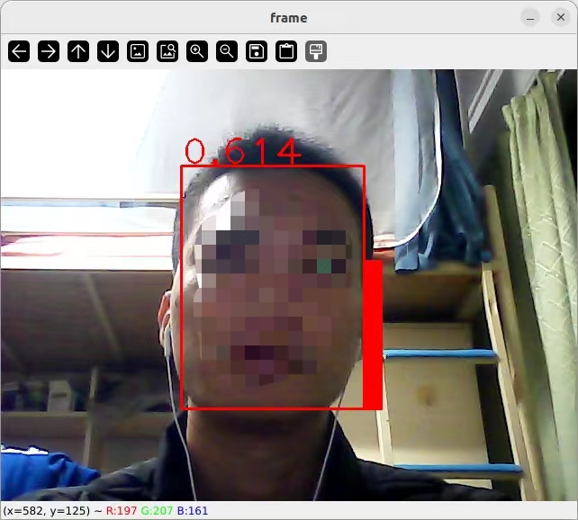

# Retinaface Face Detection

A retinaface model for Face Detection trained on widerface dataset.

Notice: This is face detection model's training, evaluation and inference scripts in HuggingFace🤗 style from scratch for practice.

## Train
Run
```bash
python train.py --model_config_file <MODEL_CONFIG_FILE>
```
<MODEL_CONFIG_FILE> can be found in folder `config`.
Model checkpoints will be saved in folder `checkpoints` by default.

backbone-ResNet50 checkpoint can be download in my [Google Drive](https://drive.google.com/drive/folders/1teN75lXOvYPLdpzLoXPEPrsXfZJU18Id?usp=sharing) or [HuggingFace🤗](https://huggingface.co/HaohuaLv/retina-backbone_resnet50-ft_widerface).

## Inference
### Observe logits map and predicted bboxes
Run
```bash
python inference.py --checkpoint_path <CHECKPOINT_PATH>
```
<CHECKPOINT_PATH> is a model folder containing `config.json` and `pytorch_model.bin`.


### Detect
Run
```bash
python detect.py --checkpoint_path <CHECKPOINT_PATH> --image_path <IMAGE_PATH> --save_path <SAVE_PATH>
```


### AP Calculation
Run
```bash
python calc_AP.py --checkpoint_path <CHECKPOINT_PATH>
```
ResNet50 Backbone (AP = 0.896)



MobileNetv2_050 Backbone (AP = 0.828)


### Export to Onnx and Video test
Run script `export_to_onnx.py` to export to onnx format. 

Run script `video_test.py` like this



## References
- [Retinface-pytorch](https://github.com/biubug6/Pytorch_Retinaface)
